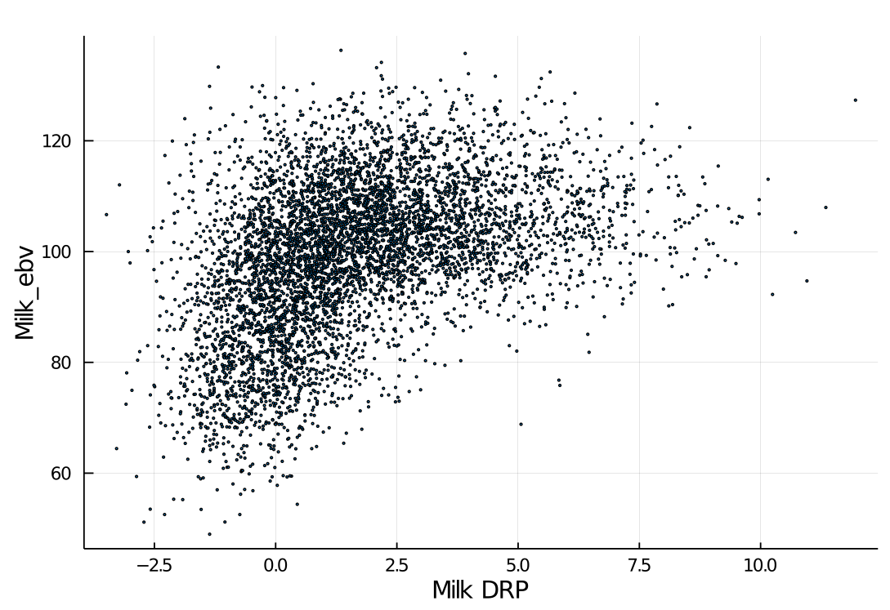

# Stage II startup
## Introduction
- Data cleaning accomplished
- CV setup
  - cv-setup.jld, drp-training.jld, ebv-all.jld, GAID.jld
  - detailed setup were in `Stage II - Cross-validation.pdf`

## Cross-validation results
- currently within countries
- Norwegian data:
  - using G: 0.15 (weighted), 0.27 (not weigthed)
  - using A: 0.38 (weighted), 0.41 (not weigthed)

## **G** vs **A** matrix

## DRP vs. EBV, Norwegian training data

## EBV vs GEBV, Norwegian validation set

## Discussion
> It seems the DRP don’t work well.  Even when using EBV, the use of weights does not work well.  Please try to use deregressed EBV Garrick et al.  (Genetics Selection Evolution 2009 41:55)

